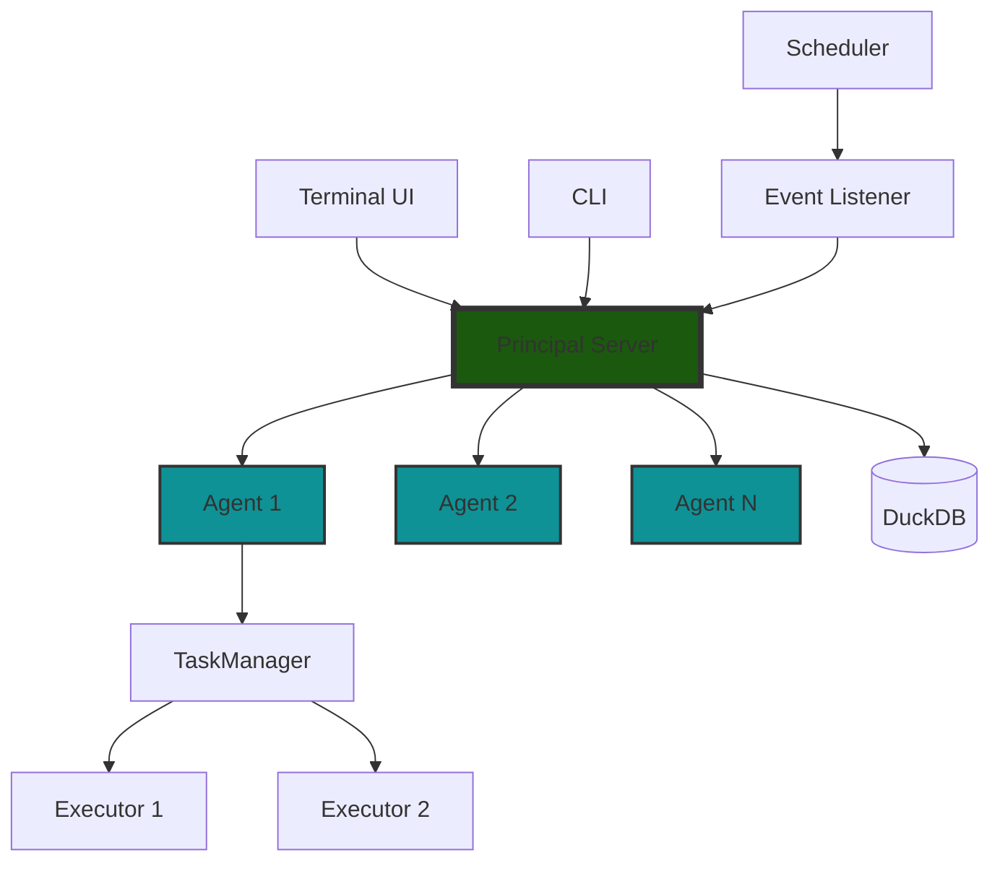

# System Overview

cdktr is built on a distributed architecture where a central **principal** process coordinates work across multiple **agents** that execute workflows. This design provides both simplicity and scalability—you can run everything on a single machine for development, or distribute agents across multiple machines for production workloads. Workflows are defined in simple YAML files that the principal automatically discovers and loads from the filesystem.

The architecture follows a pull-based model: the principal maintains a queue of workflows ready for execution, and agents poll this queue for work when they have available capacity. This self-regulating design means you can scale horizontally simply by launching more agent processes, without complex load balancing or work distribution logic.

cdktr is completely event-driven. Workflows can be triggered by cron schedules, manual requests via the CLI or TUI, or external event listeners that respond to webhooks, file changes, or any other stimulus you can program. All interactions flow through cdktr's ZeroMQ-based API, which provides a lightweight, high-performance communication layer.

## High-Level Architecture



## Core Components

The system comprises several key components that work together to provide distributed workflow orchestration:

### Principal

The principal is the system's central coordinator and single source of truth. It manages workflow definitions loaded from YAML files, maintains the global queue of workflows awaiting execution, and tracks the health and status of all registered agents.

The principal runs several background services: a scheduler that triggers workflows based on cron expressions, a log aggregation system that collects and persists execution logs to DuckDB, and a heartbeat monitor that detects failed agents. It also provides the ZeroMQ API server that handles all external communication from the TUI, CLI, agents, and event listeners.

When a workflow needs to execute—whether triggered by schedule, manual request, or external event—the principal adds it to the task queue. Agents poll this queue for work, and the principal assigns workflows on a first-come, first-served basis.

### Agents

Agents are autonomous worker processes that execute workflows. Each agent runs independently and can be deployed on the same machine as the principal or on different machines across a network. On startup, an agent registers with the principal and begins polling for available work.

When an agent receives a workflow assignment, its internal task manager analyzes the workflow's dependency graph (DAG) and executes tasks in the correct order. The task manager enables parallel execution of independent tasks, maximizing throughput. As execution progresses, the agent sends continuous status updates back to the principal and streams task output logs.

Agents are self-regulating—they only request work when they have available capacity based on their configured concurrency limits. This design means scaling is as simple as launching additional agent processes.

### Scheduler

The integrated scheduler monitors cron expressions defined in workflow files and automatically triggers workflows at their scheduled times. It maintains a priority queue of upcoming executions and checks every 500 milliseconds whether any workflow is due to run.

The scheduler periodically refreshes its view of available workflows (every 60 seconds by default), allowing you to deploy new scheduled workflows without restarting the principal. When a workflow's time arrives, the scheduler triggers it by adding it to the principal's workflow queue, where it awaits assignment to an available agent.

### Event Listeners

Event listeners provide the mechanism for external systems to trigger workflow executions. They monitor external events—such as webhooks, file changes, message queues, or any custom trigger—and send workflow execution requests to the principal via the ZeroMQ API.

cdktr doesn't include specific event listener implementations out of the box; instead, it provides the API infrastructure for you to build custom listeners tailored to your needs. Any process that can communicate via ZeroMQ can trigger workflows.

### Database

cdktr uses DuckDB, an embedded analytical database, to persist all execution history. Every workflow run, task execution, and log line gets stored in DuckDB, providing a complete audit trail queryable through both the CLI and TUI.

The database schema tracks workflow instances, task executions, status transitions, and detailed logs with timestamps. This persistent history enables debugging failed workflows, generating execution reports, and monitoring system performance over time.

## Communication Flow

### Workflow Execution Flow

A typical workflow execution follows this sequence:

1. **Trigger**: A workflow is triggered by its cron schedule, manual CLI/TUI request, or external event listener
2. **Queue**: The principal adds the workflow to its global task queue
3. **Poll**: An agent with available capacity polls the principal for work
4. **Assign**: The principal removes the workflow from the queue and sends it to the requesting agent
5. **Execute**: The agent's task manager executes workflow tasks according to their dependencies, launching executors for each task
6. **Stream Logs**: As tasks run, the agent streams stdout/stderr logs to the principal's log manager
7. **Report Status**: The agent sends status updates (PENDING, RUNNING, COMPLETED, FAILED) for each task and the overall workflow
8. **Persist**: The principal stores all status updates and logs in DuckDB for later querying

### ZeroMQ Communication Pattern

All components communicate using ZeroMQ's REQ/REP (request/reply) pattern, which provides reliable synchronous messaging:

```
Client (Agent/TUI/CLI)     Principal Server
        |                          |
        |-------- REQUEST -------->|
        |                          |
        |<------- RESPONSE --------|
        |                          |
```

This synchronous pattern ensures every request gets a response and provides natural backpressure—if the principal is overloaded, clients wait for a response rather than overwhelming the system with requests.

Logs use a separate PUB/SUB channel where agents publish log messages and the principal subscribes to receive them, enabling high-throughput, non-blocking log streaming.

## Scalability Model

cdktr's architecture enables scaling in multiple dimensions:

### Horizontal Scaling

Add more agent processes to increase total workflow throughput. Agents can run on the same machine or distributed across multiple machines. Each agent independently polls the principal for work, and the self-regulating design ensures work flows naturally to available capacity.

Since agents only request work when they're ready, there's no need for complex load balancing—agents that finish their workflows quickly will automatically pick up more work.

### Vertical Scaling

Increase the `max_concurrent_workflows` setting on agents to run more workflows simultaneously on powerful machines. Within each workflow, the task manager can execute independent tasks in parallel, making efficient use of multi-core systems.

You can also run the principal on a more powerful machine if you have thousands of workflows or very high throughput requirements, though in practice, the principal is lightweight and can handle substantial load on modest hardware.

### Workflow Parallelism

Within a single workflow, the task manager's DAG-based execution model automatically executes independent tasks in parallel. If your workflow has multiple tasks that don't depend on each other, they'll run simultaneously without any special configuration required.

## Resilience and Fault Tolerance

cdktr is designed to handle the realities of distributed systems:

**Agent Heartbeats**: Agents send heartbeats to the principal every 5 seconds. If an agent stops responding (crashed, network partition, machine failure), the principal detects this within 30 seconds and marks any workflows running on that agent as CRASHED.

**Buffered Logs**: When agents lose connection to the principal, they buffer logs locally and continue executing workflows. When the connection restores, buffered logs are sent to the principal. This prevents log loss during temporary network issues.

**Task Queue Persistence**: The principal periodically persists its workflow queue to disk. If the principal crashes and restarts, it reloads queued workflows and resumes processing.

**Graceful Degradation**: If the database becomes unavailable, the principal continues coordinating workflow execution—status updates and logs accumulate in memory until the database recovers.

**Workflow Recovery**: Failed workflows can be re-triggered manually via the CLI or TUI. The complete execution history in DuckDB helps diagnose what went wrong before retrying.

## Next Steps

Now that you understand the overall architecture, dive deeper into specific components:

- [Principal](./principal.md) - The central coordinator in detail
- [Agents](./agents.md) - How workflow execution works
- [Workflows & Tasks](./workflows-tasks.md) - Defining and structuring work
- [ZeroMQ Communication](./zeromq.md) - The messaging layer
