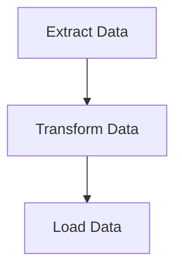
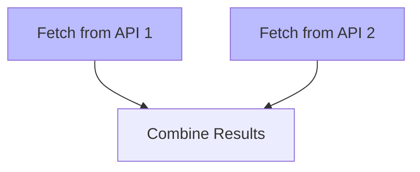

# Workflows & Tasks

Workflows and tasks are the fundamental building blocks of automation in cdktr. A **workflow** is a collection of related **tasks** that execute together as a coordinated unit, with tasks running in an order determined by their dependencies.

## What is a Workflow?

A workflow represents a complete automation process—a series of steps that together accomplish a specific goal. Think of it as a recipe: it has a name, a description of what it does, and a list of steps (tasks) to execute. Workflows can run on a schedule, be triggered manually, or respond to external events.

Workflows are defined in YAML files stored in the workflow directory (default: `workflows/`). This file-based approach provides powerful benefits:

**Source Control**: YAML files live alongside your code in Git or other version control systems. You track changes, review pull requests for workflow modifications, and maintain a complete history of your automation evolution.

**GitOps Workflows**: Deploy workflow changes through your CI/CD pipeline. When you merge a pull request that modifies a workflow YAML file, the changes automatically take effect without manual intervention.

**Hot Reload**: The principal refreshes workflows from disk every 60 seconds (configurable via `CDKTR_WORKFLOW_DIR_REFRESH_FREQUENCY_S`). Drop a new YAML file into the workflows directory, and within a minute it's loaded and available for scheduling or manual execution—no restarts required. This makes cdktr particularly well-suited for dynamic environments where workflows are frequently added or modified.

**Declarative Configuration**: YAML's human-readable format makes workflows self-documenting. Anyone can read a workflow file and understand what it does, when it runs, and how tasks depend on each other.

### Workflow Structure

Here's a complete workflow example:

```yaml
name: Data Pipeline
description: Extract, transform, and load customer data
cron: "0 0 2 * * *"  # Run daily at 2 AM
start_time: 2025-01-20T02:00:00+00:00  # Optional: delayed first run

tasks:
  extract:
    name: Extract Customer Data
    description: Pull data from production database
    config:
      !Subprocess
      cmd: python
      args: ["scripts/extract.py", "--table", "customers"]

  transform:
    name: Transform Data
    description: Clean and normalize extracted data
    depends: ["extract"]
    config:
      !UvPython
      script_path: scripts/transform.py
      packages:
        - pandas>=2.3.1
        - numpy>=1.26.0

  load:
    name: Load to Warehouse
    description: Upload transformed data to data warehouse
    depends: ["transform"]
    config:
      !Subprocess
      cmd: bash
      args: ["scripts/load.sh", "/tmp/transformed_data.csv"]
```

### Workflow Properties

**name** (required): A human-readable name for the workflow. Displayed in the TUI and CLI.

**description** (optional): Explains what the workflow does and why it exists. Good descriptions make workflows self-documenting.

**cron** (optional): A cron expression defining when the workflow should run automatically. Uses standard cron syntax with seconds precision (`seconds minutes hours day month weekday`). Omit this field for workflows that should only be triggered manually or by external events.

**start_time** (optional): An ISO 8601 timestamp indicating when the workflow should first become active. If specified with a cron schedule, the workflow won't trigger before this time even if the cron expression matches. Useful for staging workflows that shouldn't run until a specific deployment date.

**tasks** (required): A map of task definitions. Each key is a unique task identifier used for dependency declarations.

## What is a Task?

A task is a single unit of executable work. While workflows coordinate multiple steps, tasks represent individual actions: run a Python script, execute a database query, make an HTTP request, or trigger an external system.

Tasks are where the actual work happens. When an agent receives a workflow, it executes tasks one by one (or in parallel when dependencies allow), streaming logs back to the principal and reporting status as each task completes.

### Task Structure

```yaml
task_identifier:
  name: Human Readable Task Name
  description: What this task does
  depends: ["other_task", "another_task"]  # Optional
  config:
    !Subprocess  # or !UvPython
    cmd: command
    args: ["arg1", "arg2"]
```

### Task Properties

**name** (required): A descriptive name for the task, shown in logs and the TUI.

**description** (optional): Documents the task's purpose and behavior.

**depends** (optional): A list of task identifiers that must complete successfully before this task runs. This field defines the workflow's dependency graph.

**config** (required): The executable configuration specifying what to run and how to run it.

## Task Types

cdktr provides two task types optimized for different use cases:

### Subprocess Tasks

Subprocess tasks execute any command as a separate process. This is the most flexible task type—anything you can run in a terminal, you can run as a Subprocess task.

```yaml
config:
  !Subprocess
  cmd: <executable>     # Command name in PATH or absolute path
  args:                 # Optional: command arguments as list
    - <arg1>
    - <arg2>
```

**Common Examples:**

**Shell Scripts**
```yaml
config:
  !Subprocess
  cmd: bash
  args: ["./deploy.sh", "production"]
```

**Python Scripts**
```yaml
config:
  !Subprocess
  cmd: python
  args: ["analysis.py", "--date", "2025-01-20"]
```

**Database Operations**
```yaml
config:
  !Subprocess
  cmd: psql
  args: ["-h", "localhost", "-c", "VACUUM ANALYZE;"]
```

**HTTP Requests**
```yaml
config:
  !Subprocess
  cmd: curl
  args: ["-X", "POST", "-H", "Content-Type: application/json",
         "https://api.example.com/webhook", "-d", '{"status":"complete"}']
```

### UvPython Tasks

UvPython tasks run Python scripts with automatic dependency management via [uv](https://docs.astral.sh/uv/), Astral's fast Python package manager. This task type eliminates the need to pre-install dependencies or manage virtual environments—just specify the packages your script needs, and uv handles the rest.

```yaml
config:
  !UvPython
  script_path: <path_to_script>           # Required
  packages:                               # Optional: dependencies
    - package>=version
  is_uv_project: <true|false>            # Optional: default false
  working_directory: <path>              # Optional: execution directory
  uv_path: <path_to_uv>                  # Optional: custom uv binary
```

**Standalone Script with Dependencies**

Perfect for scripts that need specific packages but aren't part of a larger project:

```yaml
config:
  !UvPython
  script_path: ./process_data.py
  packages:
    - pandas>=2.3.1,<3.0.0
    - requests>=2.31.0
    - scipy>=1.11.0
```

When this task runs, uv automatically installs the specified packages in an isolated environment and executes the script.

**uv Project**

For scripts that are part of a uv project with a `pyproject.toml` file or inline dependencies (PEP 723):

```yaml
config:
  !UvPython
  script_path: ./analysis.py
  is_uv_project: true
  working_directory: ./data-pipeline
```

**Inline Dependencies (PEP 723)**

Python scripts can declare dependencies inline using PEP 723 syntax:

```python
# /// script
# dependencies = [
#   "pandas>=2.3.1",
#   "httpx>=0.25.0",
# ]
# ///

import pandas as pd
import httpx

# Your script logic here
```

Use `is_uv_project: true` to leverage these inline dependencies:

```yaml
config:
  !UvPython
  script_path: ./fetch_and_process.py
  is_uv_project: true
```

## Task Dependencies and Execution Order

Tasks declare dependencies using the `depends` field. This creates a directed acyclic graph (DAG) that determines execution order:

```yaml
tasks:
  fetch_data:
    name: Fetch Raw Data
    config:
      !Subprocess
      cmd: python
      args: ["fetch.py"]

  validate:
    name: Validate Data Quality
    depends: ["fetch_data"]
    config:
      !UvPython
      script_path: validate.py
      packages: ["great-expectations>=0.18.0"]

  process:
    name: Process and Transform
    depends: ["validate"]
    config:
      !UvPython
      script_path: transform.py
      is_uv_project: true

  report:
    name: Generate Report
    depends: ["process"]
    config:
      !Subprocess
      cmd: python
      args: ["report.py", "--output", "daily_report.pdf"]
```

This creates a linear pipeline: `fetch_data` → `validate` → `process` → `report`.

### Parallel Execution

Tasks without dependencies on each other execute in parallel:

```yaml
tasks:
  fetch_customers:
    name: Fetch Customer Data
    config:
      !Subprocess
      cmd: python
      args: ["fetch.py", "--table", "customers"]

  fetch_orders:
    name: Fetch Order Data
    config:
      !Subprocess
      cmd: python
      args: ["fetch.py", "--table", "orders"]

  fetch_products:
    name: Fetch Product Data
    config:
      !Subprocess
      cmd: python
      args: ["fetch.py", "--table", "products"]

  merge:
    name: Merge All Data
    depends: ["fetch_customers", "fetch_orders", "fetch_products"]
    config:
      !UvPython
      script_path: merge.py
      packages: ["pandas>=2.3.1"]
```

Here, the three fetch tasks run simultaneously, and the merge task only starts after all three complete successfully.

### Failure Handling

If a task fails, cdktr automatically skips all tasks that depend on it (directly or transitively). However, tasks in independent branches of the DAG continue executing:

```yaml
tasks:
  task_a:
    name: Independent Task A
    config:
      !Subprocess
      cmd: echo
      args: ["Task A runs regardless"]

  task_b:
    name: Task B
    config:
      !Subprocess
      cmd: false  # This will fail
      args: []

  task_c:
    name: Depends on B
    depends: ["task_b"]
    config:
      !Subprocess
      cmd: echo
      args: ["This gets skipped because task_b failed"]

  task_d:
    name: Independent Task D
    config:
      !Subprocess
      cmd: echo
      args: ["Task D runs regardless"]
```

If `task_b` fails, `task_c` is automatically skipped, but `task_a` and `task_d` execute normally.

## Workflow Deployment and Version Control

The real power of YAML-based workflows emerges when you treat them as code:

**1. Store workflows in Git** alongside your application code. Workflow changes go through the same review process as code changes.

**2. Deploy via CI/CD**: Your deployment pipeline can update workflow definitions by copying new YAML files to the workflow directory on your cdktr principal server.

**3. Automatic updates**: Within 60 seconds (configurable), the principal detects the new or modified workflows and reloads them. No service restarts, no manual intervention.

**4. Gradual rollouts**: Test new workflows in development, promote to staging, then production—all through version-controlled YAML files.

This workflow-as-code approach means your automation infrastructure evolves alongside your application, with the same safety nets (code review, testing, gradual rollouts) that protect your production systems.


### DAG Construction

cdktr automatically builds a directed acyclic graph (DAG) from task dependencies:



### Parallel Execution

Tasks without dependencies or with satisfied dependencies can run in parallel:

```yaml
tasks:
  fetch_api_1:
    name: Fetch from API 1
    config:
      !Subprocess
      cmd: curl
      args: ["https://api1.example.com/data"]

  fetch_api_2:
    name: Fetch from API 2
    config:
      !Subprocess
      cmd: curl
      args: ["https://api2.example.com/data"]

  combine:
    name: Combine Results
    depends: ["fetch_api_1", "fetch_api_2"]
    config:
      !Subprocess
      cmd: python
      args: ["combine.py"]
```



`fetch_api_1` and `fetch_api_2` run concurrently, then `combine` runs after both complete.

### Cycle Detection

cdktr validates workflows at load time and rejects workflows with circular dependencies:

```yaml
# INVALID: Creates a cycle
tasks:
  task_a:
    depends: ["task_b"]
    # ...
  task_b:
    depends: ["task_a"]  # ERROR: Cycle!
    # ...
```

## Workflow Execution Lifecycle

### 1. Trigger

Workflows are triggered by:
- **Scheduler**: Cron schedule matches current time
- **Manual**: `cdktr task run <workflow>` command
- **API**: External system calls PrincipalAPI

### 2. Queuing

Triggered workflow is added to principal's task queue.

### 3. Assignment

Agent polls principal and receives workflow:
- Agent has available executor slots
- Workflow assigned to requesting agent
- Agent ID and workflow instance ID recorded

### 4. Execution

TaskManager executes workflow:
1. Parse workflow DAG
2. Identify root tasks (no dependencies)
3. Execute tasks in topological order
4. Wait for dependencies before starting each task
5. Run independent tasks in parallel

### 5. Status Tracking

Agent reports status updates:
- **PENDING**: Workflow received, not started
- **RUNNING**: Workflow execution in progress
- **COMPLETED**: All tasks succeeded
- **FAILED**: One or more tasks failed
- **CRASHED**: Agent failed during execution

### 6. Completion

Final status and logs written to database.

## Workflow Discovery

Workflows are discovered from the filesystem:

1. Principal reads `CDKTR_WORKFLOW_DIR` (default: `./workflows`)
2. All `.yml` and `.yaml` files are parsed
3. Nested directories supported (creates namespaced workflow IDs)
4. Invalid workflows logged but don't prevent startup
5. Workflows refreshed periodically (every 60 seconds)

### Workflow ID Generation

Workflow IDs are derived from file paths:

```
workflows/
  example.yml          → ID: "example"
  etl/
    daily.yml          → ID: "etl.daily"
    hourly.yml         → ID: "etl.hourly"
  data/
    ingestion/
      api.yml          → ID: "data.ingestion.api"
```

## Task Execution Context

### Working Directory

Tasks execute in the agent's current working directory.

### Environment Variables

Tasks inherit the agent's environment variables.

### Standard Output/Error

Task stdout and stderr are captured and stored in the database for later querying.

### Exit Codes

- **0**: Task succeeded
- **Non-zero**: Task failed

Task failure causes the workflow to fail, and dependent tasks are not executed.

## Best Practices

1. **Keep Tasks Atomic**: Each task should do one thing well
2. **Use Dependencies Wisely**: Only declare necessary dependencies
3. **Enable Parallelism**: Structure tasks to maximize parallel execution
4. **Handle Failures**: Design workflows to be idempotent and retry-friendly
5. **Namespace Workflows**: Use directories to organize related workflows

## Next Steps

- Learn about [ZeroMQ Communication](./zeromq.md)
- Explore [Workflow Definition](../workflows.md) in detail
- See [Workflow Examples](../workflows/examples.md)
