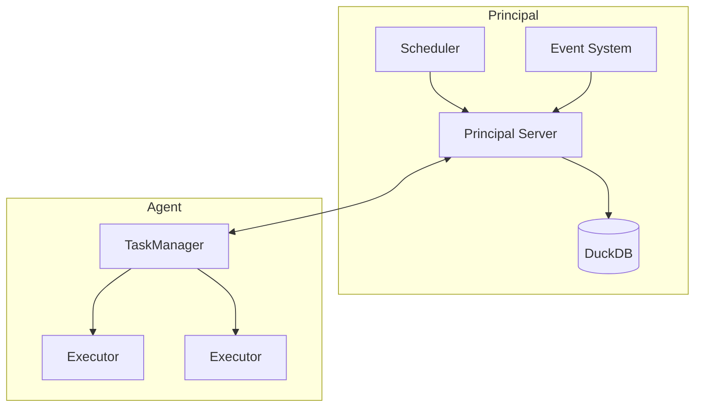

# Key Components

This chapter provides a deep dive into cdktr's internal architecture and components. Understanding these components helps with troubleshooting, performance tuning, and advanced usage.

## Component Overview

cdktr is composed of several key components:

1. **Principal Server** - Central coordinator and API server
2. **Agent TaskManager** - Workflow execution engine
3. **Scheduler** - Cron-based scheduling system
4. **Event System** - Event listeners and triggers
5. **Database** - DuckDB persistence layer

## Architecture Diagram

## Component Responsibilities

### Principal Server
- Accept and route API requests
- Maintain agent registry
- Distribute workflows to agents
- Track workflow execution state

### TaskManager
- Execute workflows on agents
- Manage executor pool
- Report status to principal
- Handle task dependencies

### Scheduler
- Monitor cron schedules
- Trigger workflows at scheduled times
- Refresh workflow definitions
- Priority queue management

### Event System
- Listen for external triggers
- Process incoming events
- Route events to workflows

### Database
- Persist execution logs
- Store workflow history
- Enable log queries
- Maintain state

## Deep Dives

Each component is covered in detail in the following sections:

- [Principal Server](./components/principal.md)
- [Agent TaskManager](./components/taskmanager.md)
- [Scheduler](./components/scheduler.md)
- [Event System](./components/events.md)
- [Database](./components/database.md)
