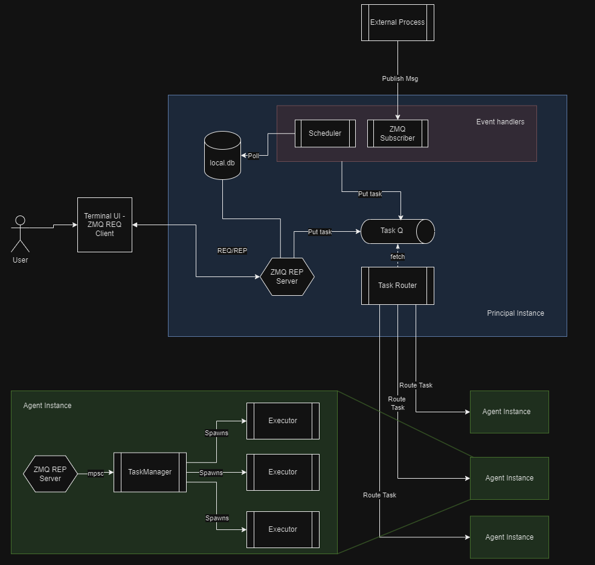

# Components

Ths section describes the components of the CDKR system in detail.

### Basic Architecture

The basic architecture of the CDKR system is shown below. The system is split into two main types of instances: Principals and Agents. Principals are responsible for managing the state of the system and for routing tasks to the correct agents. Agents are responsible for executing tasks and reporting back to the principal. You can run as many agents as you like on as many machines as you like, and even run multiple principals if you need to provide extra fault tolerance or speed. 

Each component shown in this diagram in broken-down in the following sections.

