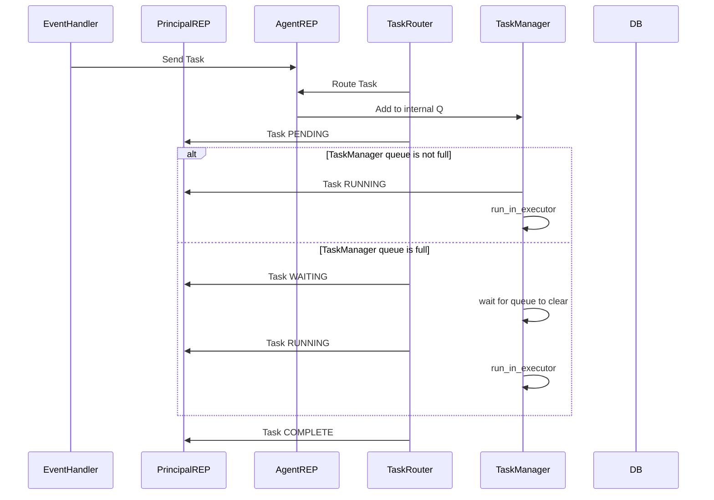

# Task Router

Once a task has been scheduled, it needs to be routed to the correct Task Manager for execution. This is handled by the Task Router, which is responsible for determining which `Agent` should handle a given task based on its available resources and the task's requirements.


### Task Routing Sequence

The below diagram shows the sequence of events that occur when a task is processed for execution by either the Scheduler or external event listener.


### Task Routing Algorithm

`TODO: full routing logic TBD`


#### Low-level details

Each Task Manager instance has a unique `instance_id` which it would have registered with the Task Router (via the Principal REP server) when it started up. The Task Router maintains a list of all active Task Managers and their available resources in the form of an internal priority queue (max-heap).

It does this by sending a `RUNTASK` with the appropriate payload message to the Agent `REP` server and its internal Task Manager will handle the task.

Example message:
```
RUNTASK|PROCESS|echo|hello world
```
Where `PROCESS` is the type of executor that the task should be executed on (more on that later), followed by the task name and the task payload.

`TODO: more details on this stuff`