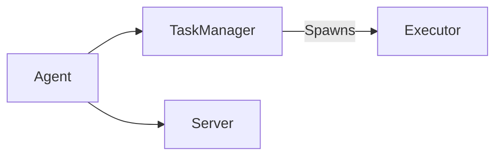

# Principals vs Agents

In the context of the CDKR, we distinguish between two types of entities: **principals** and **agents**. At a high-level, agents are responsible for executing tasks, while principals are responsible for orchestrating the execution of tasks. A principal may also be an agent, but will also be running the components responsible for orchestration and task management/distribution.

## Agents

Agents are CDKTR entities that are responsible for the execution of tasks. Agents are very lightweight and are designed to be easily scalable. They are composed of the following components:
- **TaskManager**: Responsible for executing tasks that are routed to it by its related `Principal` instance. The `TaskManager` spawns `Executor` instances to execute tasks. It also manages a `TaskManagerPub` component that listens for messages from its `Principal` instance to spawn tasks to be executed.
- **Executor**: an async task execution component spawned by the `TaskManager` to execute a single task.
- **Server**: a ZMQ `REP` component that listens for messages from its `Principal` instance for administrative tasks not-related to task execution.

## Principals

Principals are CDKTR entities that are responsible for the orchestration of tasks and act as the central point of control for the system. Fundamentally it is an extension of an `Agent` and thus comprised of the same components, but also include additional components for task routing and scheduling, such as the following:

- **TaskRouter**: Responsible for routing tasks to the appropriate `Agent` instances based on their available resources and the task's requirements.
- **Publisher**: a ZMQ PUB component that publishes messages to a single TCP socket that all `Agent` instances are connected to.
- **Scheduler**: The main event loop that polls databases for scheduled tasks and sends them to the `TaskRouter` for routing.
- **Server**: An extension of an `Agent` a ZMQ `REP` implementation - also to provide a client/request API for interacting with the `Principal` instance itself from external systems. It supports all the same endpoints as a standard `Agent` instance however, so can be treated as a drop-in replacement for an `Agent` instance without having to change it's API or implementation. 

    The `Principal` instance also implements a `REQ` coroutine that can be used to send messages to the `Agent` instances' `REP` servers. An example of this is the `AgentRequest::Ping` message that is sent to the `Agent` instances to check if they are still alive and responding.

- **EventListener**: a `TBD` component that listens for incoming flow triggers from external systems.

## Principal <=> Agent Communication

The communication between `Principal` and `Agent` instances is done via 2 types of ZeroMQ sockets:
- PUB/SUB
- REQ/REP 

### PUB/SUB

The `Principal` instance will have a `Publisher` (ZeroMQ `PUB`) component that publishes messages to a single TCP socket that all `Agent` instances are connected to (ZeroMQ `SUB`). This is the primary method of distributing tasks to the `Agent` instances for execution. Each `Agent` instance will have an `instance_id` that is used to identify it in the system and this is used to define a "topic" that the `Agent` is subscribed to. See [Task Routing](#task-routing) for more information on how tasks are routed to `Agent` instances.

### REQ/REP

The `Principal` and `Agent` instances will also communicate via ZeroMQ `REQ/REP` sockets. As mentioned above, the `Principal` instances implements both a `REP` coroutine as it's role as an `Agent` to listen to messages from a `Principal` instance, to listent to requests coming from external systems and a `REQ` function to heartbeat `Agent` instances.

#### Note on Heartbeating:

One of the main uses of a `REQ` call from the `Principal` instance to the `Agent` instance is for heartbeating. The `Agent` instance will send a heartbeat message (`AgentRequest::Heartbeat`) by some configurable interval. This is required because if there is any drop in connection between the `Principal` and `Agent` instances, or the `Principal` is restarted at any point the `Agent` instance may not be able to receive tasks from the `Principal` instance. 

Each response to the heartbeat message (`ClientResponseMessage::Heartbeat`) will contain a unique `publisher_id` that was generated by the `Principal` instance upon starting up the publisher component. 

If the ID differs to the current `publisher_id` held by the `Principal` instance,  the `Principal` instance will send a `AgentRequest::Reconnect` message to the `Agent` instance in order for the `Agent` instance to re-subscribe to the latest `Publisher` instance. This message will also contain the latest `publisher_id` so that the `Agent` instance can update it's internal state.

The `Principal` instance will have a client server (ZeroMQ `REQ`) that sends messages to the `Agent` instances' server (ZeroMQ `REP`). This is used for administrative tasks that are not related to task execution, such as starting/stopping the `Agent` instance, or querying the status of the `Agent` instance. 