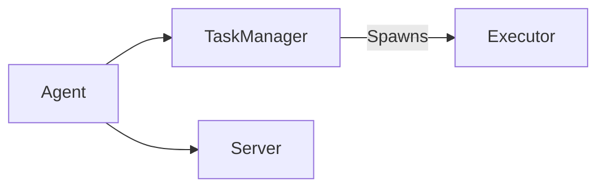

# Principals vs Agents

In the context of the CDKR, we distinguish between two types of entities: **principals** and **agents**. At a high-level, agents are responsible for executing tasks, while principals are responsible for orchestrating the execution of tasks. A principal may also be an agent, but will also be running the components responsible for orchestration and task management/distribution.

## Agents

Agents are CDKTR entities that are responsible for the execution of tasks. Agents are very lightweight and are designed to be easily scalable. They are composed of the following components:
- **TaskManager**: Responsible for executing tasks that are routed to it by its related `Principal` instance.
- **Executor**: an async task execution component spawned by the `TaskManager` to execute a single task.
- **Server**: a ZMQ REP component that listens for messages from its `Principal` instance for administrative tasks not-related to task execution.

## Principals

Principals are CDKTR entities that are responsible for the orchestration of tasks and act as the central point of control for the system.

They are composed of the following components:
- **TaskRouter**: Responsible for routing tasks to the appropriate `Agent` instances based on their available resources and the task's requirements.
- **Publisher**: a ZMQ PUB component that publishes messages to a single TCP socket that all `Agent` instances are connected to.
- **Scheduler**: The main event loop that polls databases for scheduled tasks and sends them to the `TaskRouter` for routing.
- **Server**: a ZMQ REP component that provides a client/request API for interacting with the `Principal` instance.
- **EventListener**: a `TBD` component that listens for incoming flow triggers from external systems.
