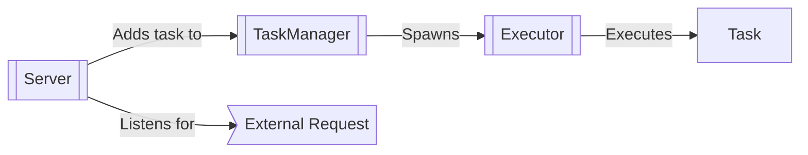
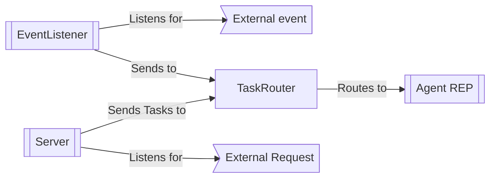

# Principals vs Agents

In the context of the CDKR, we distinguish between two types of entities: **principals** and **agents**. At a high-level, agents are responsible for executing tasks, while principals are responsible for orchestrating the execution of tasks. A principal may also be an agent, but will also be running the components responsible for orchestration and task management/distribution.

## Agents

Agents are CDKTR entities that are responsible for the execution of tasks. Agents are very lightweight and execute tasks using the Tokio async runtime. They are composed of the following components:
- **TaskManager**: Responsible for executing tasks that are routed to it by its related `Principal` instance. The `TaskManager` spawns `Executor` instances to execute tasks.
- **Executor**: an async task execution component spawned by the `TaskManager` to execute a single task.
- **Server**: a ZMQ `REP` component that listens for messages from its `Principal` instance for administrative tasks not-related to task execution.

## Principals

Principals are CDKTR entities that are responsible for the orchestration of tasks and act as the central point of control for the system. Fundamentally it is an extension of an `Agent` and thus comprised of the same components, but also include additional components for task routing and scheduling, such as the following:

- **TaskRouter**: Responsible for routing tasks to the appropriate `Agent` instances based on their available resources and the task's requirements.
- **Server**: An extension of an `Agent` a ZMQ `REP` implementation - also to provide a client/request API for interacting with the `Principal` instance itself from external systems. It supports all the same endpoints as a standard `Agent` instance however, so can be treated as a drop-in replacement for an `Agent` instance without having to change it's API or implementation. 

    The `Principal` instance also implements a `REQ` coroutine that can be used to send messages to the `Agent` instances' `REP` servers. An example of this is the `AgentRequest::Ping` message that is sent to the `Agent` instances to check if they are still alive and responding.

- **EventListener**: a high-level abstraction provided that listens for external events and sends tasks to the `TaskRouter` queue for processing.

The `Principal` and `Agent` instances communicate via ZeroMQ `REQ/REP` sockets. As mentioned above, the `Principal` instances implements both a `REP` coroutine as it's role as an `Agent` to listen to messages from a `Principal` instance, to listen to requests coming from external systems and a `REQ` function to initiate messages to `Agent` instances.
