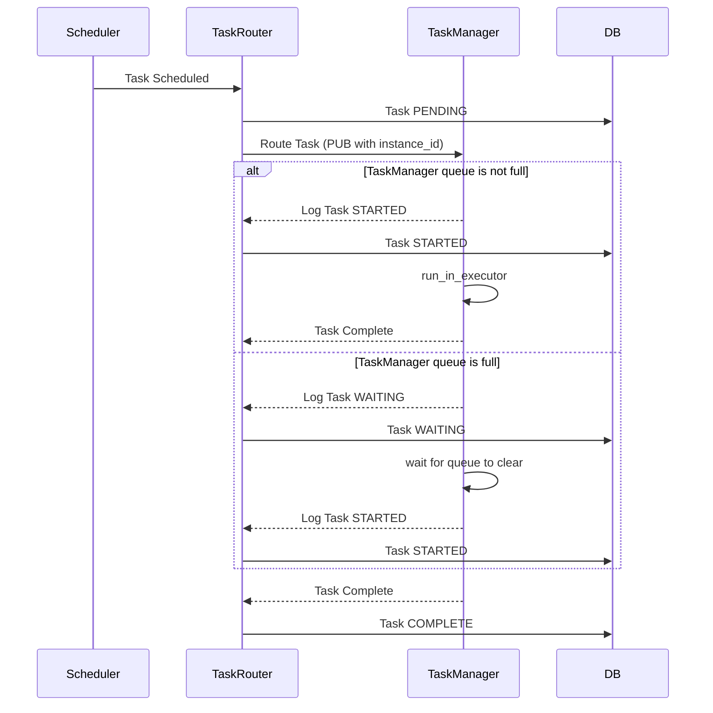

# Task Routing

Once a task has been scheduled, it needs to be routed to the correct Task Manager for execution. This is handled by the Task Router, which is responsible for determining which Task Manager should handle a given task based on it's available resources and the task's requirements.

## Task Routing Sequence

The below diagram shows the sequence of events that occur when a task is processed for execution by either the Scheduler or external event listener.


## Task Routing Algorithm

The Task Router uses a simple algorithm to determine which Task Manager should handle a given task. It first checks the Task Manager's available resources (e.g. number of executors, memory, CPU) and then compares this to the task's requirements. If the Task Manager has the resources to handle the task, it is routed to that Task Manager. If not, the Task Router will route the task to the Task Manager with the most available resources.


### Low-level details

Each Task Manager instance has a unique `instance_id` which it would have registered with the Task Router when it started up. The Task Router maintains a list of all active Task Managers and their available resources. When a task is scheduled, the Task Router will compare the task's requirements to the available resources of each Task Manager instance and route the task to the first Task Manager that can handle it.

It does this by sending a `PUB` message to the Task Manager with the `instance_id` of the Task Manager that should handle the task.

Example message:
```
TMID2|CMD|ARG1|ARG2|ARG3
```
Where `TMID2` is the `instance_id` of the Task Manager that should handle the task, and `CMD`, `ARG1`, `ARG2`, `ARG3` are the command and arguments that the Task Manager should execute. As only the Task Manager with the matching `instance_id` should be subscribed to listen for messages with that `instance_id`, only that Task Manager should receive the message and execute the task.
