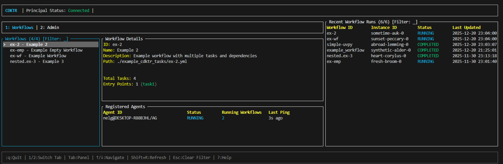

# The TUI (Terminal User Interface)

cdktr includes a powerful Terminal User Interface (TUI) built with Ratatui, providing real-time monitoring and management of workflows without requiring a web browser.



## Features

- **Workflow Management**: View all workflows and their schedules
- **Real-time Monitoring**: Watch workflow execution in real-time
- **Agent Status**: Monitor registered agents and their health
- **Manual Triggers**: Run workflows on-demand with a keypress
- **Log Viewing**: Browse execution logs directly in the terminal
- **Keyboard Navigation**: Efficient keyboard-driven interface

## Launching the TUI
To start the TUI, ensure you have a principal running that you can connect to, then run:
```bash
cdktr ui
```

## Quick Navigation

- `↑↓` or `jk` - Navigate lists
- `r` - Run selected workflow
- `q` - Quit
- `Tab` - Switch between panels
- `?` - Show help

## Sections

- [Overview](./tui/overview.md) - What the TUI provides
- [Navigation](./tui/navigation.md) - How to navigate
- [Workflow Management](./tui/workflows.md) - Managing workflows
- [Monitoring](./tui/monitoring.md) - Viewing execution status
- [Agent Management](./tui/agents.md) - Agent information
