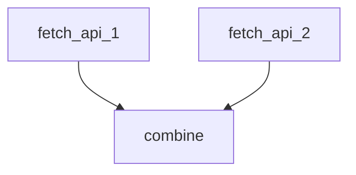
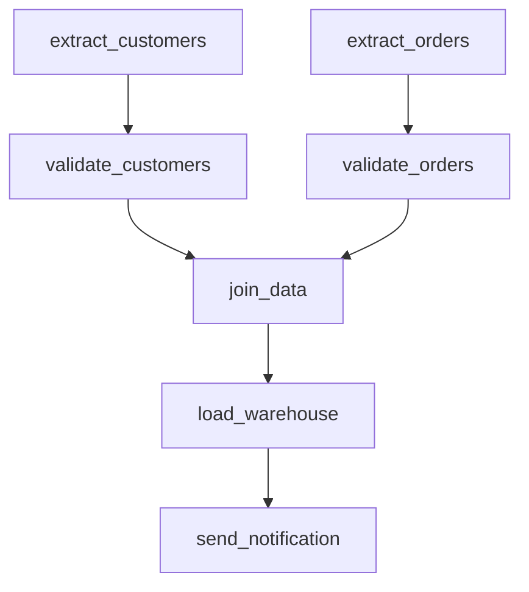

# Task Dependencies

Task dependencies allow you to define execution order and create complex workflows using directed acyclic graphs (DAGs).

## Basic Dependencies

Use the `depends` field to specify which tasks must complete before a task can start:

```yaml
tasks:
  first:
    name: First Task
    config:
      !Subprocess
      cmd: echo
      args: ["Running first"]
  
  second:
    name: Second Task
    depends: ["first"]  # Waits for 'first' to complete
    config:
      !Subprocess
      cmd: echo
      args: ["Running second"]
```

## Dependency Rules

1. **Tasks without dependencies run first**
2. **Tasks wait for all dependencies to complete**
3. **Failed dependencies prevent execution**
4. **No circular dependencies allowed**

## Multiple Dependencies

A task can depend on multiple other tasks:

```yaml
tasks:
  fetch_api_1:
    name: Fetch API 1
    config:
      !Subprocess
      cmd: curl
      args: ["https://api1.example.com"]
  
  fetch_api_2:
    name: Fetch API 2
    config:
      !Subprocess
      cmd: curl
      args: ["https://api2.example.com"]
  
  combine:
    name: Combine Results
    depends: ["fetch_api_1", "fetch_api_2"]  # Waits for both
    config:
      !Subprocess
      cmd: python
      args: ["combine.py"]
```

## DAG Visualization



## Parallel Execution

Tasks without dependencies or with satisfied dependencies run in parallel:

```yaml
tasks:
  download_1:
    name: Download Dataset 1
    config:
      !Subprocess
      cmd: wget
      args: ["https://example.com/data1.csv"]
  
  download_2:
    name: Download Dataset 2
    config:
      !Subprocess
      cmd: wget
      args: ["https://example.com/data2.csv"]
  
  download_3:
    name: Download Dataset 3
    config:
      !Subprocess
      cmd: wget
      args: ["https://example.com/data3.csv"]
```

All three downloads run simultaneously.

## Complex DAG Example

```yaml
tasks:
  extract_customers:
    name: Extract Customers
    config:
      !Subprocess
      cmd: python
      args: ["extract_customers.py"]
  
  extract_orders:
    name: Extract Orders
    config:
      !Subprocess
      cmd: python
      args: ["extract_orders.py"]
  
  validate_customers:
    name: Validate Customers
    depends: ["extract_customers"]
    config:
      !Subprocess
      cmd: python
      args: ["validate_customers.py"]
  
  validate_orders:
    name: Validate Orders
    depends: ["extract_orders"]
    config:
      !Subprocess
      cmd: python
      args: ["validate_orders.py"]
  
  join_data:
    name: Join Customer and Order Data
    depends: ["validate_customers", "validate_orders"]
    config:
      !Subprocess
      cmd: python
      args: ["join.py"]
  
  load_warehouse:
    name: Load to Warehouse
    depends: ["join_data"]
    config:
      !Subprocess
      cmd: python
      args: ["load.py"]
  
  send_notification:
    name: Send Completion Notification
    depends: ["load_warehouse"]
    config:
      !Subprocess
      cmd: curl
      args: ["-X", "POST", "https://hooks.slack.com/..."]
```



## Failure Handling

When a task fails:
1. Execution stops for that branch
2. Dependent tasks are NOT executed
3. Workflow marked as FAILED
4. Other independent branches may continue

```yaml
tasks:
  task_a:
    # ...
  
  task_b:
    # ...
  
  task_c:
    depends: ["task_a"]  # Won't run if task_a fails
    # ...
  
  task_d:
    depends: ["task_b"]  # Runs independently of task_a/task_c
    # ...
```

If `task_a` fails, `task_c` won't run, but `task_b` and `task_d` may still complete.

## Best Practices

1. **Minimize Dependencies**: Only add necessary dependencies
2. **Maximize Parallelism**: Structure tasks to run concurrently when possible
3. **Fail Fast**: Place validation tasks early in the DAG
4. **Logical Grouping**: Group related tasks in execution order
5. **Test DAG**: Verify dependency graph makes sense

## Common Patterns

### Linear Pipeline

```yaml
tasks:
  step1:
    # ...
  step2:
    depends: ["step1"]
    # ...
  step3:
    depends: ["step2"]
    # ...
```

### Fan-Out/Fan-In

```yaml
tasks:
  prepare:
    # Single preparation task
  
  process_a:
    depends: ["prepare"]  # Fan out
  
  process_b:
    depends: ["prepare"]  # Fan out
  
  process_c:
    depends: ["prepare"]  # Fan out
  
  aggregate:
    depends: ["process_a", "process_b", "process_c"]  # Fan in
```

### Diamond Pattern

```yaml
tasks:
  start:
    # ...
  
  branch_a:
    depends: ["start"]
  
  branch_b:
    depends: ["start"]
  
  end:
    depends: ["branch_a", "branch_b"]
```

## Next Steps

- See [Workflow Examples](./examples.md) for complete workflows
- Learn about [Scheduling](./scheduling.md)
- Explore [Task Configuration](./task-config.md)
